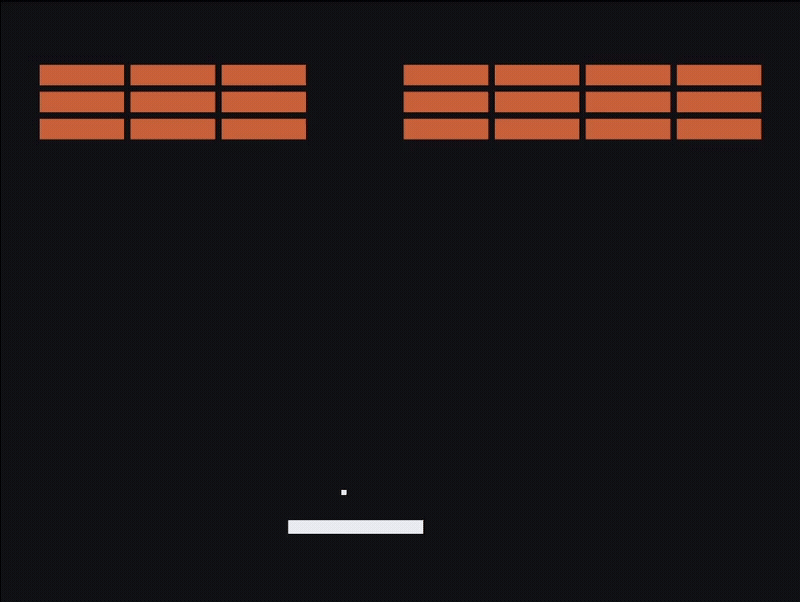

# Arkanoid-Style Tiny Game



## Why This Project Exists

Many small game projects add abstraction before the gameplay needs it.
This project keeps the runtime small and explicit:

- match architecture to problem size
- keep gameplay mutation centralized
- keep rendering read-only

## Current Scope

- solid-color primitives (no texture/sprite pipeline)
- no menus or UI systems
- no score HUD
- no powerups or special brick types
- no lives counter
- no game-over state
- no level-clear / win state

## Requirements

- Windows PowerShell workflow
- Visual Studio with MSVC (presets use generator `Visual Studio 18 2026`)
- CMake 3.21 or newer
- `VCPKG_ROOT` set to a valid vcpkg install (or pass `-VcpkgRoot` to scripts)

## How It Runs

`SDL events -> input sample -> fixed-step simulation -> read-only render`

- `src/main.cpp` owns platform loop and rendering
- In runtime code, gameplay mutation is performed through `arkanoid::Game::update()`
- `GameState` is authoritative runtime state

## Controls

- Left Arrow: move paddle left
- Right Arrow: move paddle right
- Space: serve on press in `BallReady`
- Close window: quit

## Architecture

- [Architecture](doc/architecture.md) - ownership boundaries and state model
- [Game Loop](doc/game_loop.md) - fixed-step timing and frame/update flow

## Running

One-line dev loop
```powershell
# set once per shell (or pass -VcpkgRoot directly to the script)
$env:VCPKG_ROOT = "C:\path\to\vcpkg"

# debug build (auto-launches game)
powershell -ExecutionPolicy Bypass -File .\tools\windows\dev_build.ps1

# debug build without auto-launch
powershell -ExecutionPolicy Bypass -File .\tools\windows\dev_build.ps1 -NoRun

# run tests (debug preset only; still auto-launches game)
powershell -ExecutionPolicy Bypass -File .\tools\windows\dev_build.ps1 -RunTests

# tests only (debug preset; no game launch)
powershell -ExecutionPolicy Bypass -File .\tools\windows\dev_build.ps1 -NoRun -RunTests

# release build (build preset windows-vcpkg-release; no auto-launch)
powershell -ExecutionPolicy Bypass -File .\tools\windows\dev_build.ps1 -Preset windows-vcpkg-release
```

## Static Analysis

One-line
```powershell
powershell -ExecutionPolicy Bypass -File .\tools\windows\analyze.ps1
```

Or
```powershell
cmake --preset windows-vcpkg-analyze
cmake --build --preset windows-vcpkg-debug-analyze
ctest --preset windows-vcpkg-debug-analyze
```

`analyze.ps1` runs configure + build + ctest on the analyze presets.

```powershell
powershell -ExecutionPolicy Bypass -File .\tools\windows\analyze.ps1
powershell -ExecutionPolicy Bypass -File .\tools\windows\analyze.ps1 -Clean
```

```powershell
Set-ExecutionPolicy -Scope Process -ExecutionPolicy Bypass
```

## Open in Visual Studio

1. Install Visual Studio with the **Desktop development with C++** workload.
2. Ensure `VCPKG_ROOT` is set to your vcpkg installation path.
3. Open the repository root folder in Visual Studio (`File > Open > Folder`).
4. Select configure preset `windows-vcpkg`.
5. Build in `Debug` or `Release` (corresponds to build presets `windows-vcpkg-debug` and `windows-vcpkg-release`).
6. If prompted about a toolchain/cache mismatch, click **Delete and regenerate cache**.
7. Build and run target `arkanoid`.

## License

This project is licensed under the MIT License.

Third-party libraries, fonts, and audio assets are licensed separately.
See [THIRD_PARTY_LICENSES](THIRD_PARTY_LICENSES.txt) for details.
